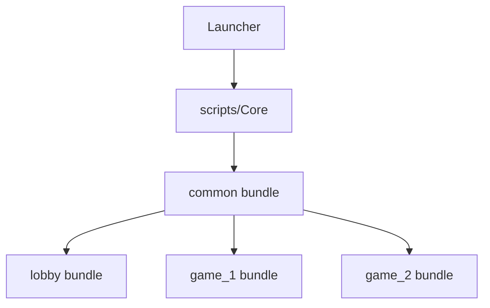

# H5 遊戲平台資源打包與 Bundle 策略說明

本文件描述 H5 遊戲平台（Cocos Creator 3.8）的資源管理架構與 Asset Bundle 分層策略，旨在達成「秒開、省電、防洩漏」的目標。

## 1. Bundle 分層規範

系統採用三層遞進式加載策略，將資源依據「生命週期」與「依賴關係」進行劃分。

### 1.1 核心層 (Core / Essential)
*   **名稱**: `scripts` (或編譯後的內置 Bundle)
*   **內容**: 所有的管理器 (Manager)、基礎基類 (MVC Base)、啟動流程 (Launcher/AppScene)、通訊協議 (Net)。
*   **特性**: 首包加載，全局駐留，不可卸載。

### 1.2 共用層 (Common Bundle)
*   **名稱**: `common`
*   **內容**: 
    - 跨遊戲組件 (如：通用老虎機輪盤、按鈕組件)。
    - 全域 UI 素材 (HUD、背景、共用特效)。
    - 多國語系配置 (i18n JSON)。
*   **特性**: 單次加載後常駐（不隨遊戲切換釋放），以減少重複下載。

### 1.3 業務層 (Feature Bundles)
*   **名稱**: `lobby` (大廳), `games/slot_master` (子遊戲)
*   **內容**: 特定模組專屬的預製體 (Prefab)、紋理 (Texture)、音效 (AudioClip)。
*   **特性**: 
    - **點擊時加載**: 使用 `ResManager.loadBundleAsync` 觸發。
    - **退出時釋放**: 遊戲結束返回大廳時，`SceneManager` 會自動調用 `releaseBundle` 以完全清理內存。

---

## 2. 資源釋放與內存管理 (Memory Management)

為了在行動端 Browser 穩定運行，系統實作了雙重保障機制：

1.  **Sandbox 隔離**: 每個遊戲加載於 `GameSandbox` 節點下。返回大廳時執行 `sandbox.destroy()`，銷毀所有的 Node 與 Component 實例。
2.  **引用計數回歸**: 透過 `ResManager.releaseBundle(name)` 的調用：
    - 將 Bundle 內所有快取資源的 `decRef()`。
    - 觸發 Cocos `assetManager.removeBundle()` 徹底移除緩存引用，確保紋理內存能夠被 GC 回收。

---

## 3. 打包與部署配置 (Build & Deploy)

### 3.1 資源優先級 (Priority)
在 Cocos Creator Bundle 配置中，應遵循以下優先級設定：
*   **Common**: 8 (優先於業務 Bundle，確保依賴優先被解析)
*   **Lobby**: 7
*   **Games**: 5

### 3.2 壓縮策略
*   為了優化 H5 載入速度，建議針對 `lobby` 與 `games` 啟用 **「合併所有 JSON」** 選項。
*   紋理資源建議啟用 **WebP 格式** 以大幅壓縮存儲體積。

---

## 4. 資源引用關係圖

> [!IMPORTANT]
> **嚴禁規則**: 禁止在 `common` bundle 中引用任何 `lobby` 或 `game` 的專屬資源，避免發生循環依賴或加載不可預期。
